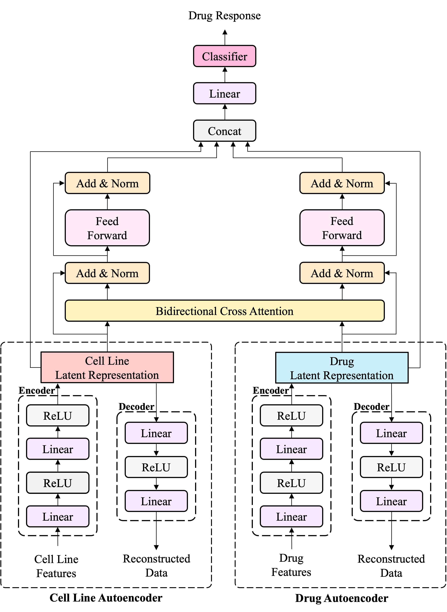

## Project Overview
암 세포주(Cell Line)와 약물(Drug) 간의 반응을 예측하기 위한 딥러닝 기반 모델을 구현한 연구 프로젝트이다. 모델은 세포주와 약물 데이터를 입력으로 받아 약물 반응(민감/내성)을 예측한다.

## Model Architecture

## How to Run (Training / Experiment)
python main.py

## Run Web Demo
uvicorn web_app:app --host 0.0.0.0 --port 8000 --reload
